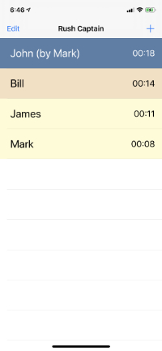

# Rush Captain
##### App that handles automatically keeping track of multiple conversation duration during a fraternity rush setting

## Installation
You can download the app from the App Store for only $0.99 to support my development efforts. The link is [https://apps.apple.com/us/app/rush-captain/id1488685592?ls=1](https://apps.apple.com/us/app/rush-captain/id1488685592?ls=1)

## How it works
Tap the edit button to set your goal swap time (ex: 2 min)
  Make sure you convert it to second
Tap the + button every time a new brother enters your area
  Enter their name
  The app will automatically create a timer and color code the timer based off of your goal swap time
  To swap brothers, tap the existing brothers name and enter the new brothers name
  Once the old brother has left the area, swipe left on their name to remove them from the list

# Support
If you have any questions, problems or feature requests: either open an Issue or Pull request on this repo or email me at ryan.cobelli@gmail.com
